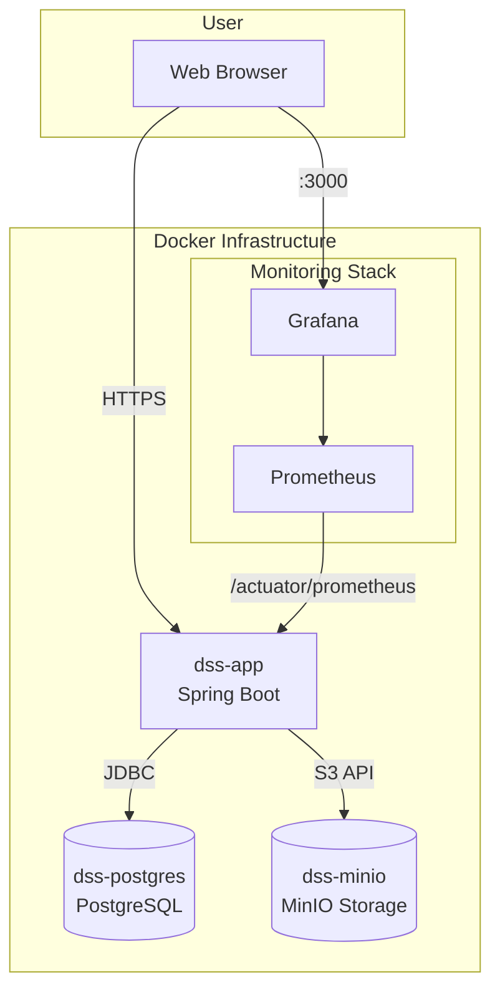

## 🚀 Document Storage Service
This project is a full-featured web service for uploading, storing, sharing, and managing documents. It has been developed using a modern Java technology stack and is fully containerized with Docker for easy deployment and scalability.

The project demonstrates enterprise development best practices, including separation of concerns, configuration management, database schema versioning with Flyway, integration testing with Testcontainers, and a complete observability stack.

## ✨ Key Features
- 🔐 **Authentication & Authorization:**

  - User registration and login.
  - Role-based access control: ```USER``` and ```ADMIN```.
  - Powered by **Spring Security** with two independent filter chains:
    - **JWT (Bearer Token)** for the REST API.
    - **Session-based (Form-Login)** for the web UI.

- 📂 **Document Management:**

  - Upload, download, and delete files.
  - Assign categories and tags.
  - Powerful filtering and searching by filename, category, and tags.
  - Paginated lists for high performance with large datasets.

- 🤝 **File Sharing:**

  - Users can share their documents with other registered users.
  - Recipients can save their own independent copy of a shared document.
  - Senders can view a list of their shared documents and revoke access at any time.

- 👑 **Admin Dashboard:**

  - Administrators have access to all documents from all users.
  - Ability to filter and search through the entire system, including by the owner's username.
  - Admins can delete any document in the system.

- 📄 **API Documentation:**

  - Automatically generated, interactive **Swagger (OpenAPI)** documentation.
  - Support for JWT authorization directly within the Swagger UI for easy testing of protected endpoints.

- 📊 **Monitoring & Observability:**

  - Real-time application metrics collection using **Spring Boot Actuator** and **Micrometer**.
  - Metrics aggregation and storage in **Prometheus**.
  - Visualization of application health and performance on a pre-configured **Grafana** dashboard.

## 🛠️ Technology Stack
|Category|Technology|
|:-|:-|
|**Backend**|Java 21, Spring Boot 3, Spring Web, Spring Data JPA, Spring Security, Spring Validation, Lombok|
|**Database**|PostgreSQL|
|**DB Migrations**|Flyway for version-controlled database schema management|
|**File Storage**|S3-Compatible Storage via MinIO|
|**Frontend**|Thymeleaf (Server-Side Templating), Bootstrap 5 (Styling)|
|**API Authentication**|JSON Web Tokens (JWT)|
|**Containerization**|Docker & Docker Compose for orchestrating the entire stack|
|**API Documentation**|Springdoc OpenAPI (Swagger UI)|
|**Monitoring**|Actuator, Micrometer, Prometheus, Grafana|

## 🏗️ Architecture
The system consists of 5 core containers running in a unified Docker network:



## 🚀 Getting Started
To run this project, you will need **Git**, **Docker**, and **Docker Compose** installed.

  1. **Clone the repository:**
```
git clone [URL_OF_YOUR_REPOSITORY]
cd [project-folder-name]
```
  2. **Configure Environment Variables:**

The ```.env``` file in the project root contains all necessary default settings (passwords, keys). You can modify them if needed.

3. **Build and run all containers:**

Execute a single command from the project's root directory:
```
docker-compose up --build
```
This command will:

- Build your Spring Boot application into a JAR file using Maven.
- Create a Docker image for your application.
- Start all 5 containers: the application, PostgreSQL, MinIO, Prometheus, and Grafana.

The application will be available a few moments after startup.

## 💻 Usage

Once the application is running, the following endpoints are available:

  - **Main Application (Web UI):**

    - URL: ```http://localhost:8080```
    - You will be redirected to the login page on your first visit.

  - **MinIO Management Console:**

    - **URL:** ```http://localhost:9001```
    - **Login:** ```minio```
    - **Password:** ```minio123``` (or as specified in your ```.env``` file)

  - **REST API Documentation (Swagger UI):**

    - **URL:** ```http://localhost:8080/swagger-ui.html```
    - To test protected endpoints, obtain a JWT token via ```/api/auth/login``` and use the "Authorize" button to apply it.

  - **Prometheus:**

    - **URL:** ```http://localhost:9090```
    - Here you can check target status (```Status -> Targets```) and run direct queries against your metrics.

  - **Grafana (Monitoring Dashboard):**

    - **URL:** ```http://localhost:3000```
    - **Login:** ```admin```
    - **Password:** ```admin``` (you will be prompted to change it on first login)
    - The "Spring Boot APM Dashboard" will be pre-installed automatically.

## Default Credentials:
An administrator user is created automatically on the first run:

  - **Username:** ```admin```
  - **Password:** ```admin```
  - **Email:** ```admin@example.com```

You can register new users through the web interface.

<!-- 🔮 Potential Future Improvements
Asynchronous UI (AJAX): Convert UI operations (delete, upload, revoke) to use JavaScript (fetch) to create a live, single-page-like experience without page reloads.

Content-based Search: Integrate Apache Tika to extract text from documents (PDF, DOCX) and implement a full-text search capability.

Event-Driven Architecture: Use RabbitMQ or Kafka for asynchronous processing of files after upload (e.g., for virus scanning, preview generation, etc.).

Advanced Testing: Add more granular Unit tests and enforce architectural rules with ArchUnit.
